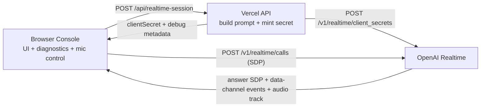
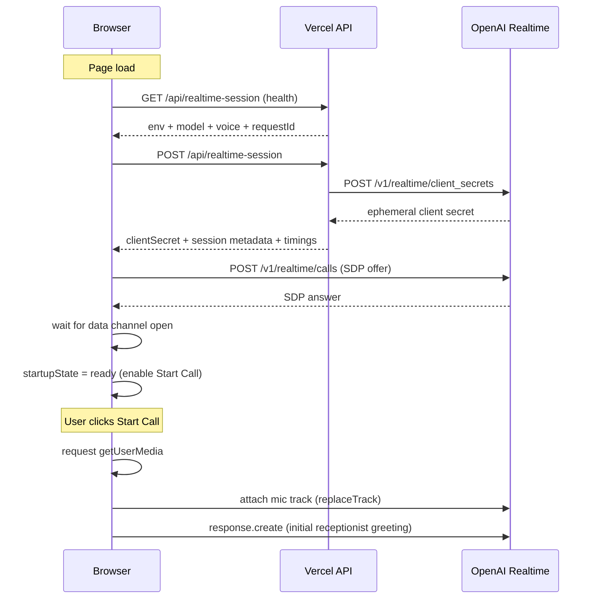

# Praxify Voice Test System - Technical Design Documentation

_Last updated: 2026-04-06_

## 1) System Purpose

This project is intentionally a **debug-first voice systems harness**, not a polished end-user application.

Primary objective:
- Validate and improve realtime speech-to-speech quality, startup latency, resilience, and protocol correctness before integrating into production call surfaces.

Non-goals for this stage:
- Persistent user conversation storage.
- Final call-center UX.
- Business analytics or billing-level telemetry.

## 2) Design Principles

1. **Security-first key handling**
- `OPENAI_API_KEY` is server-only.
- Browser receives only short-lived ephemeral `clientSecret`.

2. **Low-latency media path**
- Browser connects directly to OpenAI Realtime with WebRTC (`/v1/realtime/calls`).
- Server remains out of the media path after token minting.

3. **Observable by default**
- Every critical startup stage records timing.
- Event counts and local decision logs are visible in UI.
- Snapshot export enables reproducible debugging.

4. **State clarity over implicit behavior**
- Explicit call phases reduce hidden coupling and UI ambiguity.

5. **Stateless deployability**
- Compatible with serverless functions (Vercel).
- No local server memory assumptions across requests.

## 3) Runtime Architecture

## Components
- **Browser UI**
  - Captures mic audio.
  - Negotiates WebRTC.
  - Renders transcript + debug diagnostics.
- **Vercel API (`/api/realtime-session`)**
  - Validates env.
  - Builds grounded receptionist instructions.
  - Requests ephemeral secret from OpenAI.
  - Returns debug metadata and timings.
- **OpenAI Realtime API**
  - Session execution and audio generation.
  - Data-channel lifecycle events.
  - Remote assistant audio track.

## Data flow
1. UI -> `POST /api/realtime-session`
2. Server -> `POST /v1/realtime/client_secrets`
3. UI <- `{ clientSecret, model, voice, debug }`
4. UI -> `POST /v1/realtime/calls` (SDP with `clientSecret`)
5. UI <-> realtime events over data channel
6. UI <- assistant audio via remote WebRTC media track

## High-level diagram


## Low-level startup sequence diagram


## 4) Frontend Structure

## Files and responsibilities
- `src/features/voice-console/useRealtimeCall.ts`
  - Connection orchestration and protocol event handling.
  - Timing instrumentation and debug log stream.
  - Health checks and snapshot export.
- `src/features/voice-console/callTypes.ts`
  - Canonical state and action contracts.
- `src/features/voice-console/callReducer.ts`
  - Deterministic state transitions and transcript merge semantics.
- `src/features/voice-console/useAudioMeter.ts`
  - Mic level analysis using `AnalyserNode` RMS approximation.
- `src/features/voice-console/VoiceConsole.tsx`
  - Operator-facing call and debugging UI.
- `src/App.tsx`
  - App shell and mode switch (`Realtime Console` vs `Technical Docs`).

## Why reducer + hook architecture
- Side effects (WebRTC, fetch, event channels) are isolated in a hook.
- Render components stay mostly declarative.
- State transitions become easier to test and reason about.
- Debug logic is co-located with lifecycle logic, not scattered across UI components.

## 5) Backend API Design

## Endpoint behavior
- `GET /api/realtime-session`
  - Health endpoint for deployment/operator checks.
  - Returns config booleans and default model/voice.
- `POST /api/realtime-session`
  - Mints ephemeral secret.
  - Returns session metadata and debug timings.

## Response fields (POST)
- `clientSecret`
- `model`
- `voice`
- `expiresAt`
- `sessionId`
- `instructionHash`
- `debug`
  - `requestId`
  - `env.openaiApiKeyConfigured`
  - `timingsMs.instructionBuild`
  - `timingsMs.openaiRequest`
  - `timingsMs.total`
  - `upstreamRequestId`

## Error model
- `assistant_not_configured`
- `realtime_session_failed`
- `missing_client_secret`
- `realtime_session_error`

Each error response includes request identifiers and timings where possible for incident triage.

## 6) Realtime Event Handling Strategy

## Event categories consumed
- Input speech lifecycle
  - `input_audio_buffer.speech_started`
  - `input_audio_buffer.speech_stopped`
- User transcription
  - `conversation.item.input_audio_transcription.delta`
  - `conversation.item.input_audio_transcription.completed`
- Assistant response lifecycle
  - `response.created`
  - `response.done`
- Assistant transcript
  - `response.output_audio_transcript.delta`
  - `response.output_audio_transcript.done`
  - `response.output_text.delta`
  - `response.output_text.done`
- Error path
  - `error`

## Barge-in decision
- On `input_audio_buffer.speech_started` while assistant is speaking,
  client sends `response.cancel`.
- Cooldown (`BARGE_IN_COOLDOWN_MS`) protects against repeated cancel storms.

## 7) Diagnostics and Bottleneck Analysis

## UI instrumentation exposed to operators
- **Connection Timings (ms)**
  - `GET /api/realtime-session (health)`
  - `POST /api/realtime-session`
  - `createOffer + setLocalDescription`
  - `POST /v1/realtime/calls`
  - `setRemoteDescription`
  - `RTC data channel open`
  - `attach microphone track`
- **Event Counts**
  - Frequency view of protocol event flow.
- **Debug Logs**
  - Timestamped local decision trace.
- **Copy Debug Snapshot**
  - Exports structured JSON for issue reports.

## Practical bottleneck method
1. Run health check first.
2. Compare server token mint latency against SDP negotiation latency.
3. Verify event lifecycle completeness (`speech_started` -> response events).
4. Capture snapshot and correlate with Vercel/OpenAI request IDs.

## 8) Security and Privacy

- API keys are never exposed in browser bundles.
- Only ephemeral session secret is sent client-side.
- No backend transcript persistence in current design.
- Snapshot export may include transcript content and user-agent information; treat as internal debug artifact.

## 9) Developer Maintenance Guide

## Rules for safe edits
- Any lifecycle change must be reflected in:
  - reducer transitions,
  - status rendering,
  - snapshot schema,
  - regression checklist.
- Any backend response shape change must be reflected in typed client parsing.
- Keep receptionist grounding logic centralized in `server/site-assistant-knowledge.ts`.

## Adding a new metric (recommended pattern)
1. Start `performance.now()` at boundary.
2. Record success/failure with `pushMetric(step, start, ok, detail)`.
3. Keep stable metric names to preserve comparability across runs.

## 10) Operational Commands

```bash
# Local dev
npm install
npm run dev:vercel

# Build check
npm run build

# Local health
curl -s http://localhost:3000/api/realtime-session

# Deployed health
curl -s https://voice-web-rust.vercel.app/api/realtime-session

# Mint session debug payload
curl -s -X POST https://voice-web-rust.vercel.app/api/realtime-session

# Deployment inspection
npx vercel inspect voice-web-rust.vercel.app

# Runtime logs (requires authenticated CLI)
npx vercel logs voice-web-rust.vercel.app --since=1h
```

## 11) Regression Checklist

- `npm run build` passes.
- `GET /api/realtime-session` reports `openaiApiKeyConfigured: true` in target env.
- Call startup metrics render with all critical steps.
- Barge-in still interrupts assistant response.
- Snapshot export includes metrics, event counts, logs, and session metadata.

## 12) Current Limitations and Roadmap

Current:
- Diagnostics are session-local and in-memory.
- No long-term metric aggregation.
- No automated end-to-end synthetic checks.

Suggested next:
- Persist anonymized timing summaries for trend analysis.
- Add percentile latency dashboard (p50/p90/p99 by step).
- Add scripted smoke test that validates health + session mint continuously.
- Add explicit versioned debug schema for easier tooling integration.

